| #input_x                  |#output_x                  | #input_x                  |#output_x                  |
| :------------------- | :------------------- | :------------------- | :------------------- |
| main_01.cpp                | output_01.png| main_04.cpp                | output_04.png|
|                            | 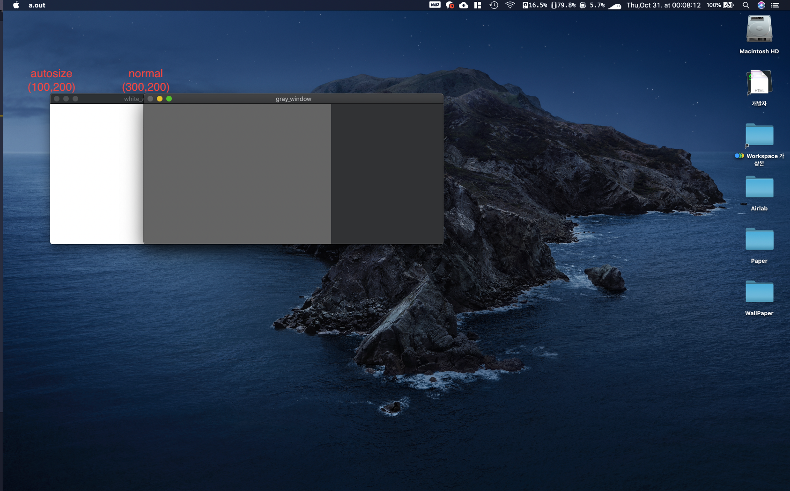|                            | 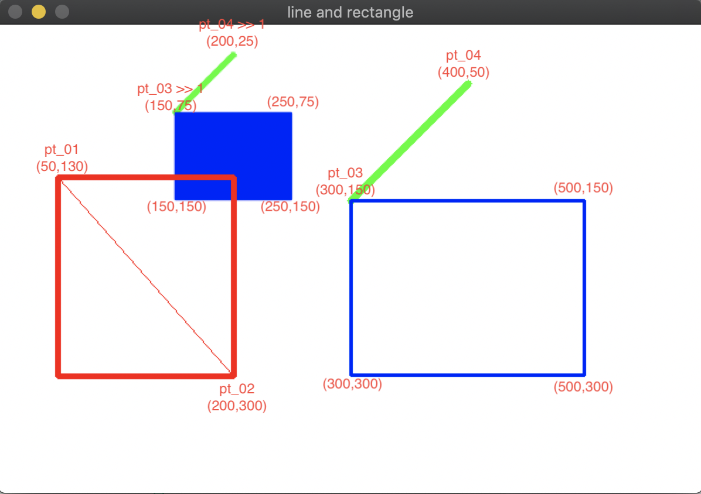|
| main_05.cpp                | output_05.png| main_06.cpp                | output_06.png|
|                            | 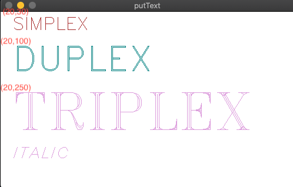|                            | 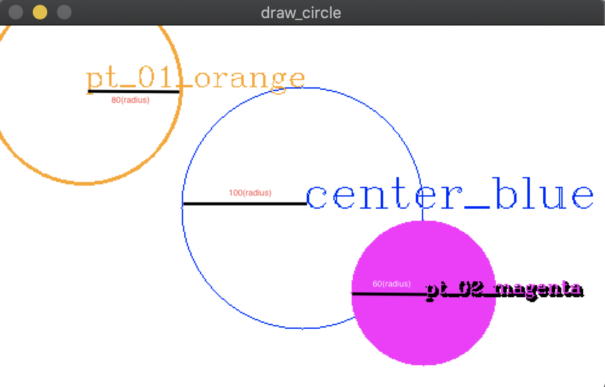|
| main_07.cpp                | output_07.png| main_08.cpp                | output_08.png|
|                            | |                            | 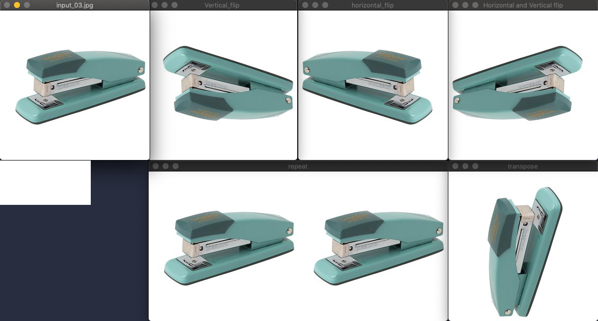|
| main_09.cpp                | output_09.png| main_10.cpp                | output_10.png|
|                            | 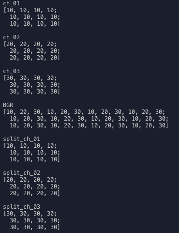|                            | 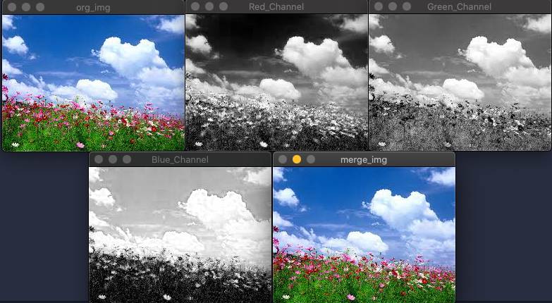|
| main_11.cpp                | output_11.png| main_12.cpp                | output_12.png|
|                            | 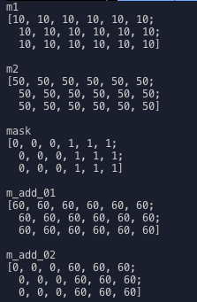|                            | 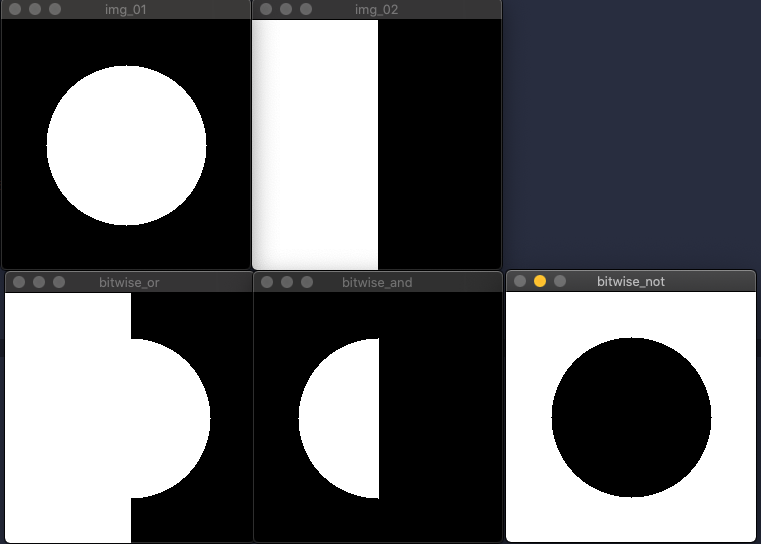|
| main_12.cpp                | output_12.png| main_13.cpp                | output_13.png|
|                            | |                            | 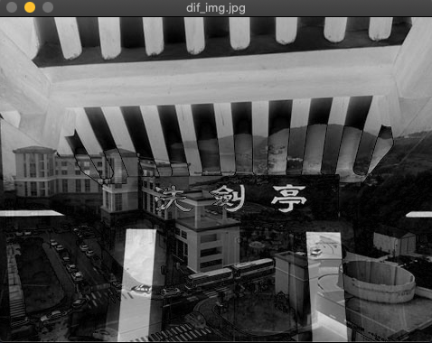|
| main_14.cpp                | output_14.png| main_13.cpp                | output_13.png|
|                            | 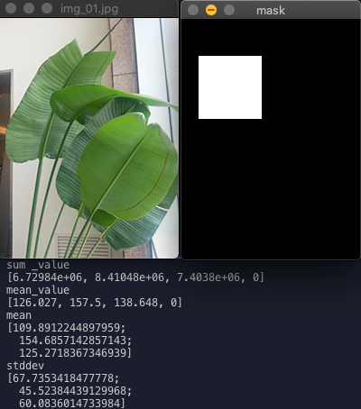|                            | |

