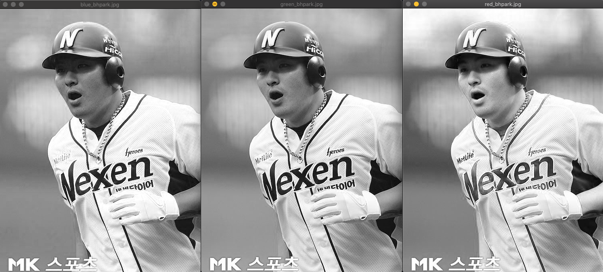

## 1. 다음을 수행하는 프로그램을 작성하시오.

 1). bhPark.jpg 영상을 읽어들여서 창에 띄우시오. 
 2). 읽어 온 영상의 해상도(width x height), depth, 채널수, 영상파일크기 등을 알아 볼 수 있도록
     프로그래밍 하시오. 
 3). 읽어온 영상을 R/G/B채널로 분리하시오. 
 4). 분리된 각 채널을 bhPark_blue.jpg, bhPark_green.jpg, bhPark_red.jpg 로 각각 따로 저장하시오. 
 5). 저장된 파일을 읽어들여서 창에 띄우시오. 

    

| #input_x                  |#output_x                  |
| :------------------- | :------------------- |
|bhpark.jpg |split for bhpark.jpg|
|  | |

		