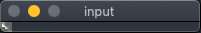
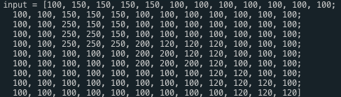
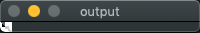
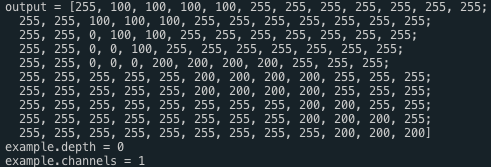
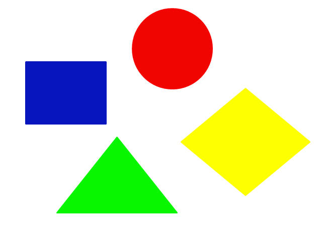
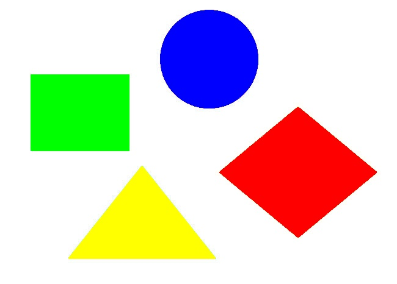

## task 01. 다음을 프로그래밍으로 구현하시오.

```
100 150 150 150 150 100 100 100 100 100 100 100
100 100 150 150 150 100 100 100 100 100 100 100
100 100 250 150 150 100 100 100 100 100 100 100
100 100 250 250 150 100 100 100 100 100 100 100
100 100 250 250 250 200 120 120 120 100 100 100
100 100 100 100 100 200 200 120 120 100 100 100
100 100 100 100 100 200 200 200 120 100 100 100
100 100 100 100 100 100 100 100 120 120 100 100
100 100 100 100 100 100 100 100 120 120 120 100
100 100 100 100 100 100 100 100 100 120 120 120
```
> 다음의 행렬은 10 x 12 크기이고, 행렬은 1채널의 8비트 데이터이다.

1. 위 행렬을 data[ ]로 나타내시오. 

2. Mat 클래스를 이용하여 img 이름으로 선언하고, data[ ]를 10 x 12 영상을 나타낼 수 있도록 하시오. 
3. imshow( )를 이용하여 영상을 띄우시오. 
4. img.dpeth( )와 img.channels( )를 조사하시오. 
5. img영상내에서 250 값은 0으로 바꾸고, 100의 값은 255로 바꾸고, 120의 값은 200으로, 150의 값은 100으로 바꾸시오. [이때, for문을 사용하고, for 문의 상한으로는 img.rows와 img.cols를 사용하고, 변수로는 Point pt;선언하여 pt.x, pt.y를 사용하시오]

### 결과

- **input**





- **output**




## task 02. 영상 색상 변경
1. Mat image = imread( ) 함수를 이용하여 영상을 읽어 오시오.

2. 주어진 image에서 빨강원은 파랑원으로, 노랑마름모는 빨강마름모로, 초록삼각형은 노랑삼각형으로, 파랑 사각형은 초록사각형으로 바꾸는 프로그램을 작성하시오.
3. 결과를 imshow( )를 통해 띄우도록 하시오. 제대로 되었는지 확인하시오.


### 결과
- **input img**



- **output img**



