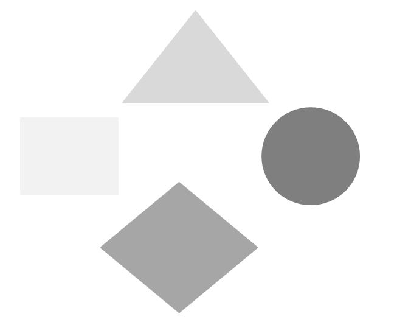
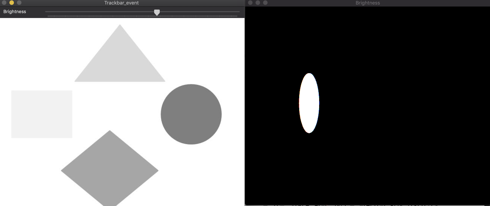
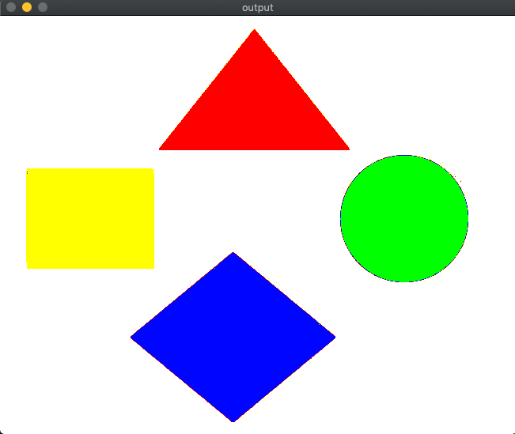
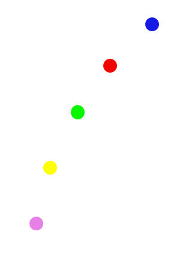
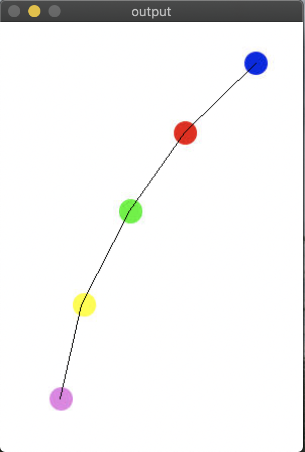
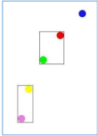
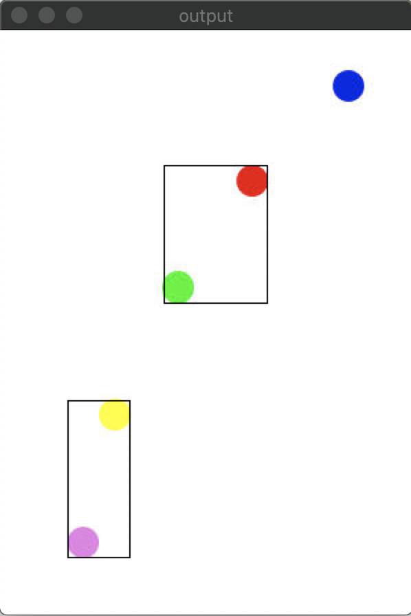
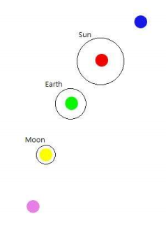
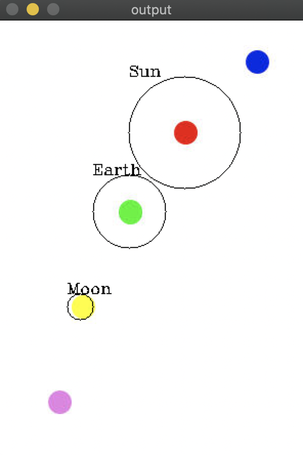

## task 01. 다음을 프로그래밍으로 구현하시오.

1. 위 영상을 Mat img1 = imread( ) 함수를 이용하여 영상을 읽어 오시오.
2. 또 다른 영상을 저장하기 위해 Mat img2;로 하고, 이것은 칼라(3채널)로 저장하기 위해 선언하시오.
3. 위의 grayscale영상에서 원은 초록색으로, 마름모는 파랑색으로, 삼각형은 빨강색으로, 직사각형은 노랑색
으로 만들어 화면에 띄우시오. 이때, 위1과 비교하여 제대로 되었는지 확인하시오.

### 결과
  
먼저, threshold_value를 찾기위해 trackbar 를 이용하여 값을 찾는다. 찾은 값들을 이용하여 task-01/main_02.cpp를 실행 시킨다. 
  

## task 02. 다음을 프로그래밍으로 구현하시오.
  

1. Mat image = imread( ) 함수를 이용하여 영상을 읽어 오시오. 2. 각 원의 중심좌표를 구하시오. 3. 주어진 “hwfig3-2.jpg” 영상 내에 있는 각 원의 중심좌표(무게중심좌표)를 구하고, 그 중심좌표를 직
선으로 연결하여 다음과 같은 결과를 얻도록 프로그래밍하시오. [참조 hwfig3-23.jpg]

### 결과

  

## task 03. 다음을 프로그래밍으로 구현하시오.
아래의 그림과 같이 분홍색과 노랑색을 사각형으로 테두리하고, 초록색과 빨강색을 사각형으로 테두
리를 만드는 그 결과를 프로그래밍하시오.

  

### 결과

  

## task 04. 다음을 프로그래밍으로 구현하시오.
아래의 그림에서 노랑색 원은 반지름의 1.2배한 원을 그린 후 “Moon”이라는 이름을 부여하였고, 초
록색 원은 반지름의 3배한 원을 그린 후 “Earth”라는 이름을 부여하였으며, 빨강색 원은 반지름의 5배
한 원을 그린 후 “Sun”이라는 이름을 부여하였다. 이러한 결과를 얻도록 프로그래밍하시오.

  

### 결과

  
