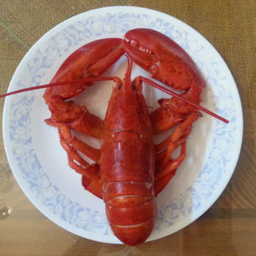
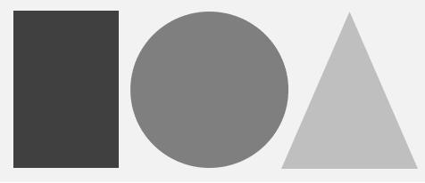
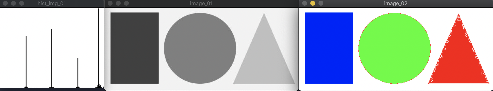
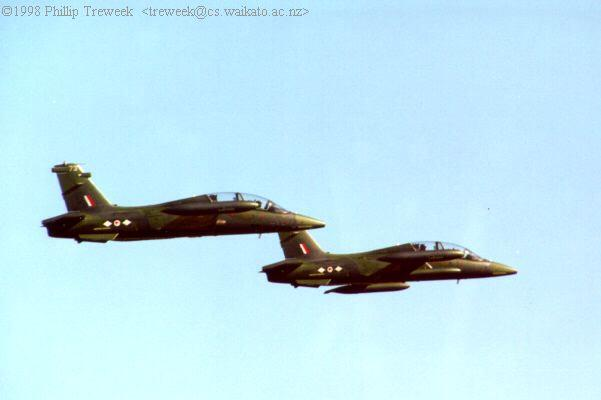
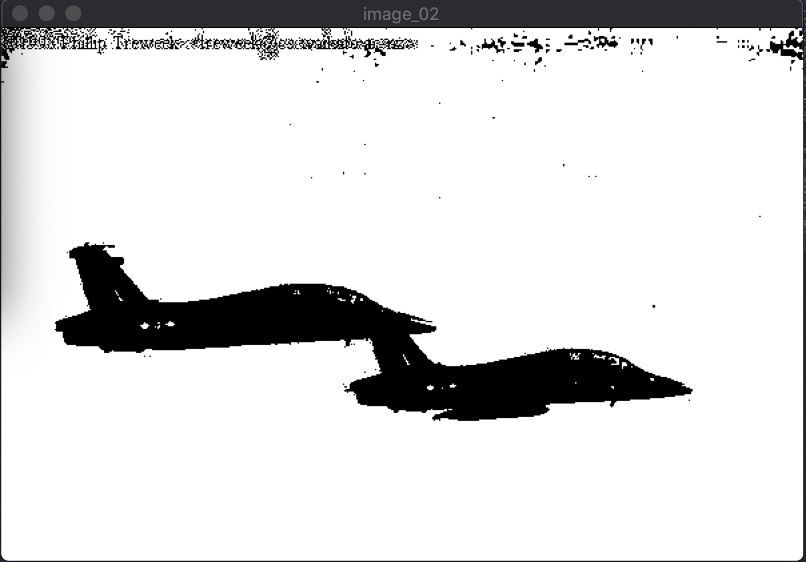
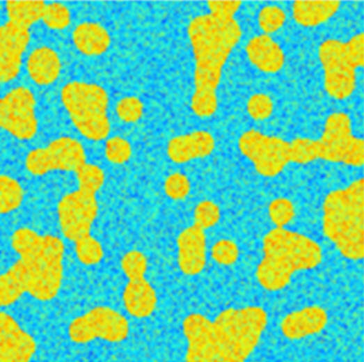
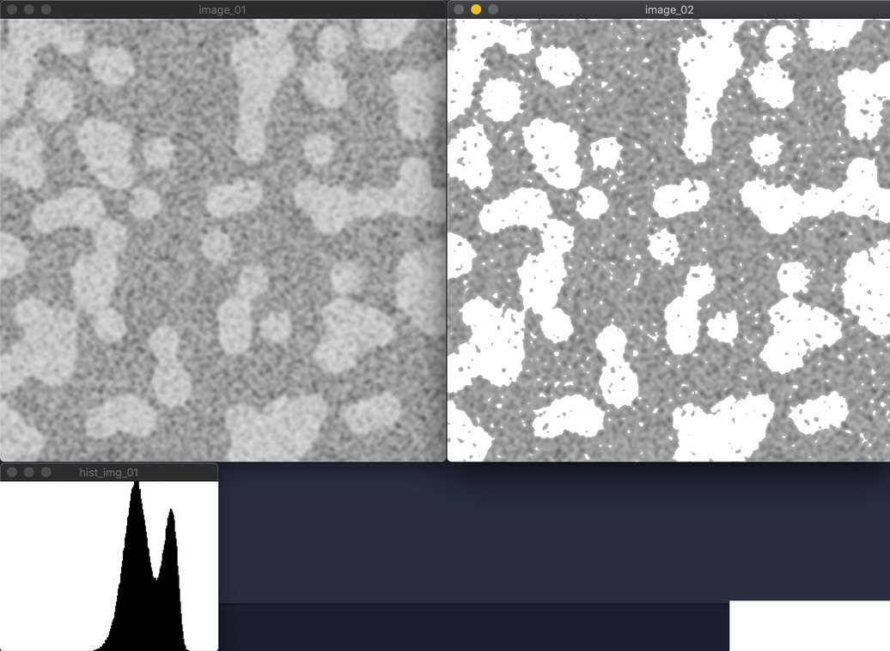

| #input_x                  |#output_x                  |
| :------------------- | :------------------- |
| example_01.cpp                ||
|    | |
| main_01.cpp                ||
|  | |
| main_02.cpp                ||
|  | |
| main_03.cpp                ||
|  | |
