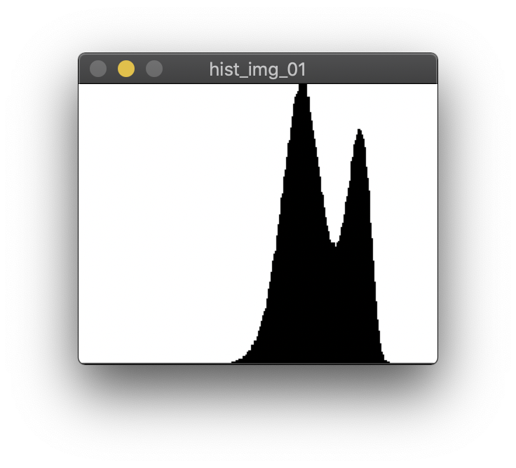

# main_01.cpp

|                  |                  |
| :------------------- | :------------------- |
| origin_hist_image                | avg(3)_hist_image|
| |   |
| avg(5)_hist_image                | avg(7)_hist_image|
|  |  |
| avg(11)_hist_image                | |
|  |  |
| origin_th_image                | avg(3)_th_image          |
|  |  |
| avg(5)_th_image                | avg(7)_th_image          |
|  |  |
| avg(11)_th_image                |          |
|  |  |

