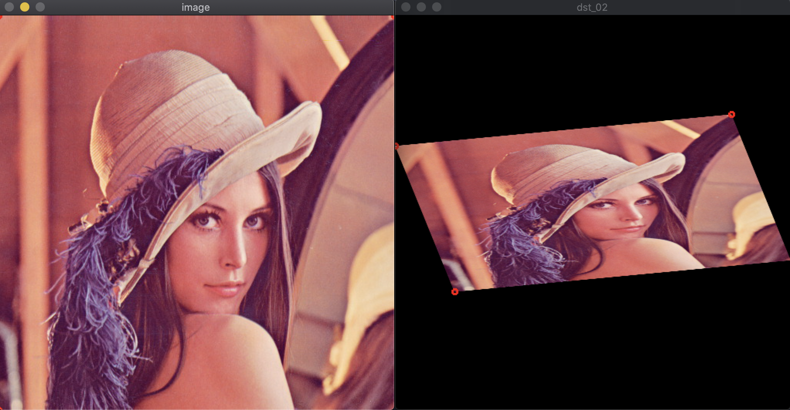

# example_01.cpp & main_0x.cpp

|                  |                  |
| :------------------- | :------------------- |
| example_01.cpp               | main_01.cpp|
| |   |
| main_02.cpp                | main_03.cpp  |
|  |  |